# Useful-apps-for-Windows
В данном репозитории мы подробно рассмотрим ряд полезных приложений для Windows, способных значительно упростить вашу работу и повысить продуктивность. Мы уделим внимание не только функциональным программам, но и утилитам для оптимизации системы, которые помогут поддерживать ваш компьютер в отличном состоянии. Эти инструменты позволят вам максимально эффективно использовать возможности операционной системы Windows и сделают вашу работу более комфортной и безопасной.

## Подборка видео (на YouTube):
- ["Удали эти программы прямо сейчас! Windows 10/11 улучшение"](https://www.youtube.com/watch?v=6KE4lt2KCa8) (FISPEKT)
- ["Скачай эти программы прямо сейчас! Windows 10/11 учлучшение"](https://www.youtube.com/watch?v=yaUhNYsRyi0) (FISPEKT)
- ["Делаем Windows 10/11 красивее и удобнее"](https://www.youtube.com/watch?v=kYYqyjjNtfc) (FISPEKT)
- ["Настраиваем qBitTorrent"](https://www.youtube.com/watch?v=34XfuxGRG4w) (IT Explainer)
- ["19 бесплатных программ для Windows..."](https://www.youtube.com/watch?v=IgL9GVwIasc) (Werstey)
- ["Красивые программы для Windows 11..."](https://www.youtube.com/watch?v=u-EW9tLMfZg) (MartyFiles)

## Таблица быстрого доступа приложений:
| Коммуникации и браузеры | Оптимизация и инструменты ПК | Мультимедиа и файлы |
|------------------------|------------------------------|---------------------|
| [Mozilla Firefox (Браузер)](#mozilla-firefox-браузер) | [Revo Uninstaller (Деинсталлятор)](#revo-uninstaller-деинсталлятор-программ) | [Steam (Магазин игр)](#steam-магазин-игр) |
| [Google Chrome (Браузер)](#google-chrome-браузер) | [IObit Driver Booster (Обновление драйверов)](#iobit-driver-booster-обновление-драйверов) | [Epic Games (Магазин игр)](#epic-games-магазин-игр) |
| [Telegram (Мессенджер)](#telegram-мессенджер) | [Everything (Поиск файлов)](#everything-поисковик-файлов) | [Obsidian (Заметки)](#obsidian-программа-для-заметок) |
| [Discord (Геймерская платформа)](#discord-геймерская-платформа) | [Windscribe (VPN-сервис)](#winscribe-vpn-сервис) | [VLC Media Player](#vlc-media-player-медиапроигрыватель) |
| | [Bitwarden (Менеджер паролей)](#bitwarden-менеджер-паролей) | [OBS Studio (Стриминг)](#obs-studio-запись-и-стриминг) |
| **Сжатие и архивация** | **Очистка и анализ диска** | **Работа с файлами** |
| [ShareX (Скриншоты)](#sharex-скриншоты-и-запись-экрана) | [BleachBit (Очистка системы)](#bleachbit-очистка-системы) | [LocalSend (Обмен файлами)](#localsend-обмен-файлами-по-сети) |
| [Caesium (Сжатие фото)](#caesium-image-compressor-сжатие-изображений) | [WizTree (Анализ диска)](#wiztree-анализ-дискового-пространства) | [qBittorrent (Торрент)](#qbittorrent-торрент-клиент) |
| [CompressO (Сжатие видео)](#compresso-сжатие-видео-без-потери-качества) | [AllDup (Поиск дубликатов)](#alldup-поиск-дубликатов) | [Jopdf (PDF редактор)](#jopdf-pdf-редактор) |
| [7-Zip (Архиватор)](#7-zip-архиватор) | | |
| **Кастомизация и безопасность** | **Оптимизация Windows** | **Облачные сервисы** |
| [WinDynamicDesktop (Динамические обои)](#windynamicdesktop-динамические-обои) | [WinToys (Настройка Windows)](#wintoys-оптимизация-windows) | [iCloud (Apple облако)](#icloud-облачное-хранилище-apple) |
| [MinerSearch (Удаление майнеров)](#minersearch-поиск-и-удаление-майнеров) | [Win10Tweaker (Твикер)](#win10tweaker-оптимизация-windows) | |

## Mozilla FireFox (Браузер):

Скачать приложение:
  - [Официальный сайт](https://www.mozilla.org/ru/firefox/new/)
  - [Microsoft Store](https://apps.microsoft.com/detail/9NZVDKPMR9RD?hl=ru&gl=RU&ocid=pdpshare)
  - [Apple Store](https://apps.apple.com/us/app/firefox-private-web-browser/id989804926)

Настройка:
  - ["Full-FireFox-browser-setup"](https://github.com/Un1korm/Full-FireFox-browser-setup) (Un1korm)
  - ["Настраиваем Firefox для полной анонимности..."](https://www.youtube.com/watch?v=XLOvZCdzwp8) (CyberYozh)
  - ["Кастомизация Firefox - сторонние темы..."](https://www.youtube.com/watch?v=pcQzxkQwFk0&t) (Markella's)
  - ["Прокачка браузера FireFox..."](https://www.youtube.com/watch?v=PGF8H-iCudk&t) (ГЛАВНАЯ МРАЗЬ ЮТУБА)

Это бесплатный веб-браузер с открытым исходным кодом, разработанный компанией Mozilla. Он предлагает пользователям высокую скорость загрузки страниц, поддержку множества расширений и функций для повышения безопасности и конфиденциальности. Firefox включает встроенные инструменты для блокировки трекеров и защиты от вредоносных сайтов. Браузер доступен на различных платформах, включая Windows, macOS, Linux, Android и iOS.

## Google Chrome (Браузер):

Скачать приложение:
  - [Официальный сайт](https://www.google.com/chrome/) (Обычная версия)
  - [Официальный сайт](https://www.google.com/chrome/what-you-make-of-it/) (Web версия)
  - [Apple Store](https://apps.apple.com/ru/app/chrome-%D0%B1%D1%80%D0%B0%D1%83%D0%B7%D0%B5%D1%80-%D0%BE%D1%82-google/id535886823)

Настройка:
  - ["Кастомизация интерфейса Chrome..."](https://www.youtube.com/watch?v=nYhK3FhaHHk) (OfficialBRO)
  - ["Give your Google Chrome a Clean and Professional Look"](https://www.youtube.com/watch?v=0sbS69jSz24) (PosInTech)
  - ["34 ЛУЧШИХ РАСШИРЕНИЙ ДЛЯ Chrome..."](https://www.youtube.com/watch?v=DMp5GiK6zWk) (Andegrand)
  
Бесплатный веб-браузер, разработанный компанией Google, известен своей высокой скоростью и простотой использования. Он поддерживает множество расширений и тем, что позволяет пользователям настраивать браузер под свои нужды. Chrome также предлагает функции синхронизации между устройствами, встроенную защиту от вредоносных сайтов и регулярные обновления для повышения безопасности. Браузер доступен на различных платформах, включая Windows, macOS, Linux, Android и iOS.

## Bitwarden (Менеджер паролей):

Скачать приложение:
  - [Официальный сайт](https://bitwarden.com/download/)
  - [Официальный сайт Mozilla](https://addons.mozilla.org/en-US/firefox/addon/bitwarden-password-manager/?browser=firefox) (Расширение в FireFox)
  - [Официальный сайт Google](https://chromewebstore.google.com/detail/bitwarden-%D0%BC%D0%B5%D0%BD%D0%B5%D0%B4%D0%B6%D0%B5%D1%80-%D0%BF%D0%B0%D1%80%D0%BE%D0%BB%D0%B5/nngceckbapebfimnlniiiahkandclblb?hl=ru&utm_source=ext_sidebar) (Расширение в Google)
  - [Microsoft Store](https://apps.microsoft.com/detail/9PJSDV0VPK04?hl=ru&gl=RU&ocid=pdpshare)
  - [Apple Store](https://apps.apple.com/us/app/bitwarden-password-manager/id1137397744)

Менеджер паролей Bitwarden предлагает пользователям безопасное хранение и управление паролями, а также генерацию надежных паролей для различных учетных записей. Он обеспечивает шифрование данных на стороне клиента, что гарантирует защиту личной информации. Bitwarden поддерживает синхронизацию между устройствами и предоставляет возможность совместного использования паролей с другими пользователями. Приложение доступно на различных платформах, включая Windows, macOS, Linux, Android и iOS.

## Winscribe (VPN-сервис):

Скачать приложение:
  - [Официальный сайт](https://windscribe.com/download/)
  - [Apple Store](https://apps.apple.com/us/app/windscribe-vpn/id1129435228)

Настройка:
  - ["КАК ПОЛЬЗОВАТЬСЯ WINDSCRIBE..."](https://www.youtube.com/watch?v=lkp6Tx0AcwY) (VPN Эксперт)

Это VPN-сервис, который обеспечивает безопасное и анонимное интернет-соединение, позволяя пользователям обходить географические ограничения и защищать свои данные от слежки. Он предлагает функции шифрования, блокировки рекламы и защиты от утечек DNS. WinScribe также предоставляет возможность выбора серверов в различных странах для оптимизации скорости и доступа к контенту. Приложение доступно на различных платформах, включая Windows, macOS, Linux, Android и iOS.

## Telegram (Мессенджер):

Скачать приложение:
  - [Официальный сайт](https://desktop.telegram.org/)
  - [Microsoft Store](https://apps.microsoft.com/detail/9NZTWSQNTD0S?hl=neutral&gl=RU&ocid=pdpshare)
  - [Apple Store](https://apps.apple.com/us/app/telegram-messenger/id686449807)

Настройка:
  - ["Обход блокировок в России"](https://github.com/Flowseal/tg-ws-proxy) (Flowseal)
  - ["Анонимность в Телеграм..."](https://www.youtube.com/watch?v=cFWK7EozcIQ) (Фантомас)

Популярный мессенджер позволяет пользователям обмениваться текстовыми сообщениями, фотографиями, видео и файлами. Он предлагает функции групповых чатов, каналов и ботов, что делает его удобным для общения и получения информации. Telegram акцентирует внимание на безопасности, предлагая шифрование сообщений и возможность создания секретных чатов. Приложение доступно на различных платформах, включая Windows, macOS, Linux, Android и iOS.

## Discord (Геймерская платформа):

Скачать приложение:
  - [Официальный сайт](https://discord.com/)
  - [Microsoft Store](https://apps.microsoft.com/detail/XPDC2RH70K22MN?hl=ru&gl=RU&ocid=pdpshare)
  - [Apple Store](https://apps.apple.com/us/app/discord-talk-play-hang-out/id985746746)

Настройка:
  - ["Лучшие и полезные ПЛАГИНЫ для ДИСКОРД..."](https://www.youtube.com/watch?v=Sm_JkNS2cJw) (Фрости)
  - ["Лучшие и полезные ПЛАГИНЫ ДИСКОРД..."](https://www.youtube.com/watch?v=KO5c199fbpM) (OfficialBRO)

Многофункциональная платформа для общения, ориентированная на геймеров и сообщества, позволяет пользователям создавать текстовые и голосовые каналы. Discord предлагает функции видеозвонков, обмена файлами и интеграцию с играми, что делает его удобным для совместной игры и общения. Пользователи могут настраивать свои серверы, добавлять ботов и управлять правами доступа. Приложение доступно на различных платформах, включая Windows, macOS, Linux, Android и iOS.

## Steam (Магазин игр):

Скачать приложение:
  - [Официальный сайт](https://store.steampowered.com/about/)
  - [Apple Store](https://apps.apple.com/us/app/steam-mobile/id495369748)

Настройка:
  - ["ПРОВЕРИЛ 32 СЕРВИСА ПОПОЛНЕНИЯ СТИМ..."](https://www.youtube.com/watch?v=q4NBiRZatQo&t) (STEAMATE)
  - ["Смена региона STEAM 2025..."](https://www.youtube.com/watch?v=uKawuDbiBDQ) (Buzzard)
  - ["Как Пополнить Стим 2025..."](https://www.youtube.com/watch?v=ZRuYllFCDoA) (DorrianKarnett™)

Платформа для цифровой дистрибуции игр и программного обеспечения, позволяющая пользователям покупать, загружать и играть в игры. Steam предлагает функции социальной сети, включая возможность добавления друзей, чатов и групповых игр. Пользователи также могут участвовать в распродажах и получать доступ к эксклюзивным предложениям. Приложение доступно на различных платформах, включая Windows, macOS и Linux.

## Epic Games (Магазин игр):

Скачать приложение:
  - [Официальный сайт](https://store.epicgames.com/ru/download)
  - [Microsoft Store](https://apps.microsoft.com/detail/XP99VR1BPSBQJ2?hl=ru&gl=RU&ocid=pdpshare)

Настройка:
  - ["СМЕНА РЕГИОНА в EPIC GAMES STORE..."](https://www.youtube.com/watch?v=1poDn4xBIYI) (heybk)
  - ["Как оплатить игру в EPIC GAMES рублями?..."](https://www.youtube.com/watch?v=hMx6S3lUcZE) (Pay Unlimited)

Платформа для цифровой дистрибуции игр, предлагающая пользователям доступ к большому количеству игр, включая эксклюзивные проекты. Epic Games Store регулярно проводит распродажи и предлагает бесплатные игры, что привлекает множество пользователей. Платформа также поддерживает функции социальной сети, такие как добавление друзей и создание групп. Приложение доступно на различных платформах, включая Windows, macOS и мобильные устройства.

## Obsidian (Программа для заметок):

Скачать приложение:
  - [Официальный сайт](https://obsidian.md/download)
  - [Apple Store](https://apps.apple.com/us/app/obsidian-connected-notes/id1557175442)

Настройка:
  - ["Как запоминать ВСЕ с помощью Obsidian..."](https://www.youtube.com/watch?v=Tae0BwhenRQ&t) (ZProger [IT])
  - ["Вам всем нужны эти плагины Obsidian!"](https://www.youtube.com/watch?v=QUK0euS_o1Y) (ZProger [IT])

Программа для создания и управления заметками, основанная на принципах связного мышления и организации информации. Obsidian позволяет пользователям создавать заметки в формате Markdown и связывать их между собой, что облегчает навигацию и поиск информации. Она поддерживает плагины и темы, что позволяет настраивать интерфейс под свои нужды. Приложение доступно на различных платформах, включая Windows, macOS и Linux.

## Everything (Поисковик файлов):

Скачать приложение:
  - [Официальный сайт](https://www.voidtools.com/ru-ru/downloads/)

Программа для быстрого поиска файлов и папок на компьютере, обеспечивающая мгновенные результаты благодаря индексации содержимого дисков. Everything позволяет пользователям легко находить нужные файлы по имени и предоставляет возможность фильтрации и сортировки результатов. Интерфейс программы прост и интуитивно понятен, что делает её удобной в использовании. Приложение доступно на платформах Windows и macOS.

## Revo Uninstaller (Деинсталлятор программ):

Скачать приложение:
  - [Официальный сайт](https://www.revouninstaller.com/ru/revo-uninstaller-free-download/)

Программа для удаления приложений и очистки системы от остатков файлов и записей в реестре. Revo Uninstaller предлагает несколько режимов удаления, включая стандартный и продвинутый, что позволяет пользователям эффективно управлять установленными программами. Она также включает инструменты для управления автозагрузкой и поиска программ. Приложение доступно на платформах Windows.

## Driver Booster (Обновление драйверов):

Скачать приложение:
  - [Официальный сайт](https://ru.iobit.com/driver-booster.php)
  - [Microsoft Store](https://apps.microsoft.com/detail/XPFM0B62TJ71KR?hl=ru&gl=RU&ocid=pdpshare)

Программа для автоматического обновления драйверов на компьютере, обеспечивающая стабильную работу оборудования и улучшение производительности системы. IObit Driver Booster сканирует систему на наличие устаревших драйверов и предлагает их обновление одним кликом. Она также включает функции резервного копирования и восстановления драйверов. Приложение доступно на платформах Windows.

## ShareX (Скриншоты и запись экрана):

**Скачать приложение:**
  - [Официальный сайт](https://getsharex.com/)
  - [Microsoft Store](https://apps.microsoft.com/detail/9nblggh4z1sp?hl=ru-RU&gl=RU)
  - [GitHub](https://github.com/ShareX/ShareX)
  - [Steam](https://store.steampowered.com/app/400040/ShareX/)

Мощная программа с открытым исходным кодом для создания скриншотов, записи экрана и загрузки файлов. ShareX поддерживает множество сервисов для быстрой публикации изображений, текста и видео. Пользователи могут автоматизировать рабочие процессы, настраивать горячие клавиши и использовать редактор изображений. Доступна только для Windows.

## VLC Media Player (Медиапроигрыватель):
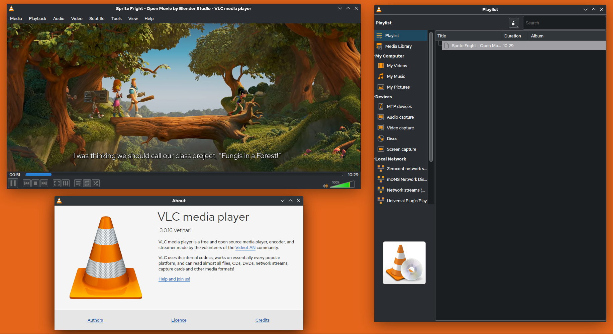

**Скачать приложение:**
  - [Официальный сайт](https://www.videolan.org/vlc/)
  - [Microsoft Store](https://apps.microsoft.com/detail/xpdm1zw6815mqm?hl=ru-RU&gl=AR)
  - [Apple Store](https://apps.apple.com/app/vlc-media-player/id650377962)

Универсальный бесплатный медиапроигрыватель с открытым исходным кодом, поддерживающий практически все форматы аудио и видео без необходимости установки дополнительных кодеков. VLC умеет воспроизводить повреждённые или недогруженные файлы, стримить контент по сети, применять фильтры и менять скины. Доступен на Windows, macOS, Linux, Android и iOS.

## OBS Studio (Запись экрана):

**Скачать приложение:**
  - [Официальный сайт](https://obsproject.com/ru)
  - [Microsoft Store](https://apps.microsoft.com/detail/xpffh613w8v6lv?hl=ru-RU&gl=RU)

Профессиональное программное обеспечение с открытым исходным кодом для захвата видео, записи экрана и потокового вещания в реальном времени. OBS Studio позволяет создавать сцены с множеством источников (окна, игры, веб-камеры), настраивать переходы, применять фильтры и использовать горячие клавиши. Поддерживает все популярные платформы для стриминга. Доступен на Windows, macOS и Linux.

## BleachBit (Очистка системы):

**Скачать приложение:**
  - [Официальный сайт](https://www.bleachbit.org/)

Бесплатная программа с открытым исходным кодом для очистки дискового пространства и защиты конфиденциальности. BleachBit удаляет временные файлы, кэш браузеров, cookies, логи и другие ненужные данные. Также включает функцию затирания свободного места для безвозвратного удаления файлов. Поддерживает Windows и Linux.

## LocalSend (Обмен файлами по сети):
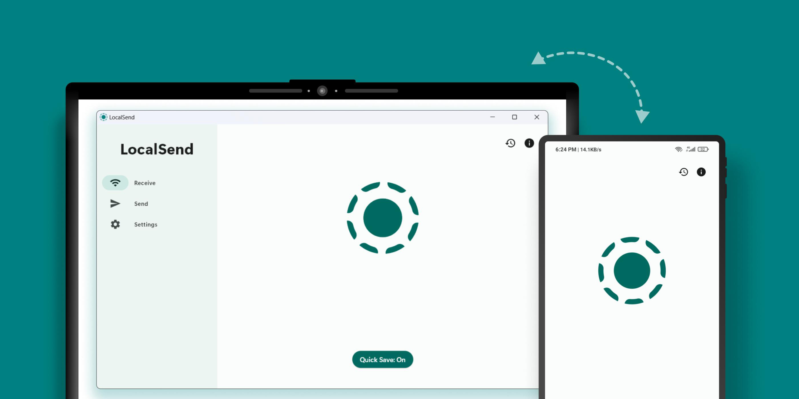

**Скачать приложение:**
  - [Официальный сайт](https://localsend.org/)
  - [Apple Store](https://apps.apple.com/app/localsend/id1661733229)

Бесплатное приложение с открытым исходным кодом для мгновенной передачи файлов между устройствами в локальной сети. LocalSend не требует интернета, регистрации или облачных сервисов — всё работает по технологии peer-to-peer. Поддерживает отправку фото, видео, документов и целых папок. Доступен на Windows, macOS, Linux, Android и iOS.

## Caesium Image Compressor (Сжатие изображений):
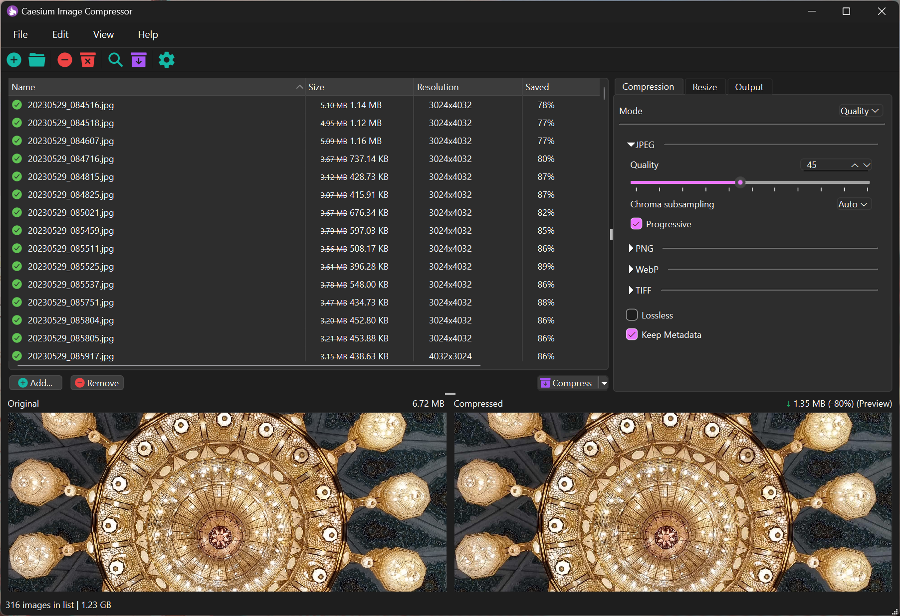

**Скачать приложение:**
  - [Официальный сайт](https://saerasoft.com/caesium)
  - [GitHub](https://github.com/Lymphatus/caesium-image-compressor)

Бесплатный инструмент с открытым исходным кодом для сжатия PNG, JPG и WebP изображений без заметной потери качества. Caesium поддерживает пакетную обработку, предпросмотр результата и настройку уровня сжатия. Позволяет уменьшить размер изображений до 80%, сохраняя оригинальное разрешение. Доступен на Windows, macOS и Linux.

## CompressO (Сжатие видео):
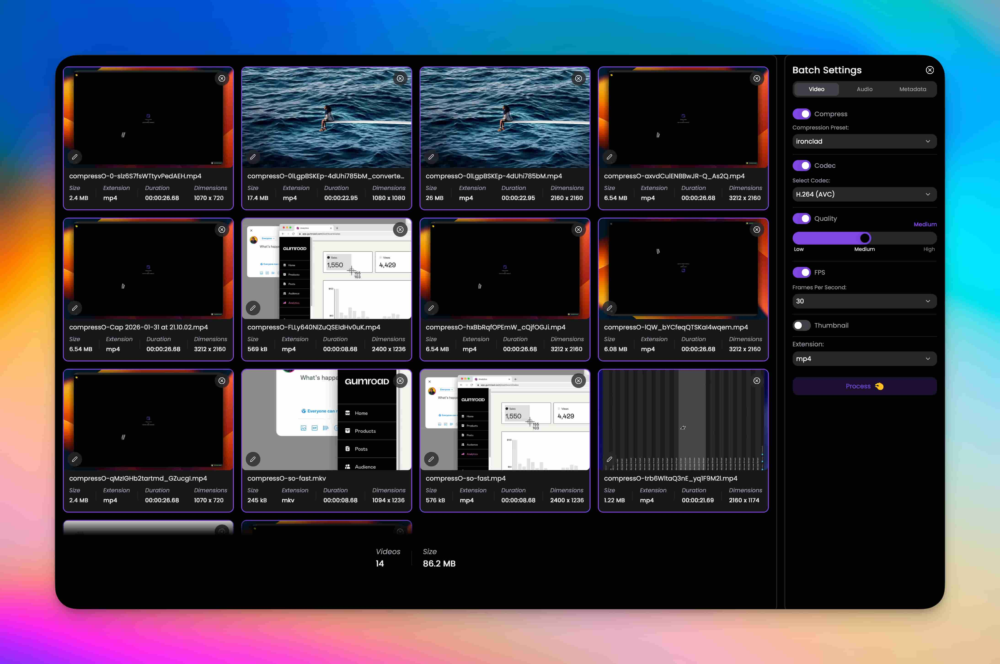

**Скачать приложение:**
  - [Официальный сайт](https://compresso.codeforreal.com/)

Мощный бесплатный компрессор видео на английском языке, который работает **локально в браузере** — ничего не загружается на сервер, всё сжатие происходит на вашем устройстве. Позволяет сжимать ролики с минимальной потерей качества, например, с 500 МБ до 50 МБ. Поддерживает пакетную загрузку нескольких видео одновременно — можно запустить конвертацию и заниматься своими делами. Идеально подходит, когда нужно быстро отправить тяжёлый файл через Telegram, почту или мессенджеры. Доступен через веб-интерфейс на Windows, macOS и Linux.

## WizTree (Анализ дискового пространства):
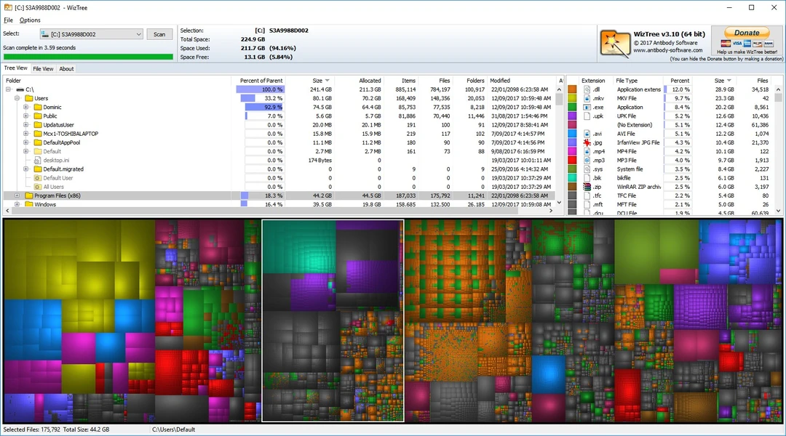

**Скачать приложение:**
  - [Официальный сайт](https://wiztreefree.com/)

Мгновенный анализатор дискового пространства, который считывает данные напрямую из MFT (Master File Table), что делает его самым быстрым среди аналогов. WizTree отображает занятое место в виде интерактивной древовидной карты (treemap), позволяя визуально определить самые большие папки и файлы. Поддерживает NTFS, FAT, exFAT и сетевые диски. Доступен только для Windows.

## qBittorrent (Торрент-клиент):
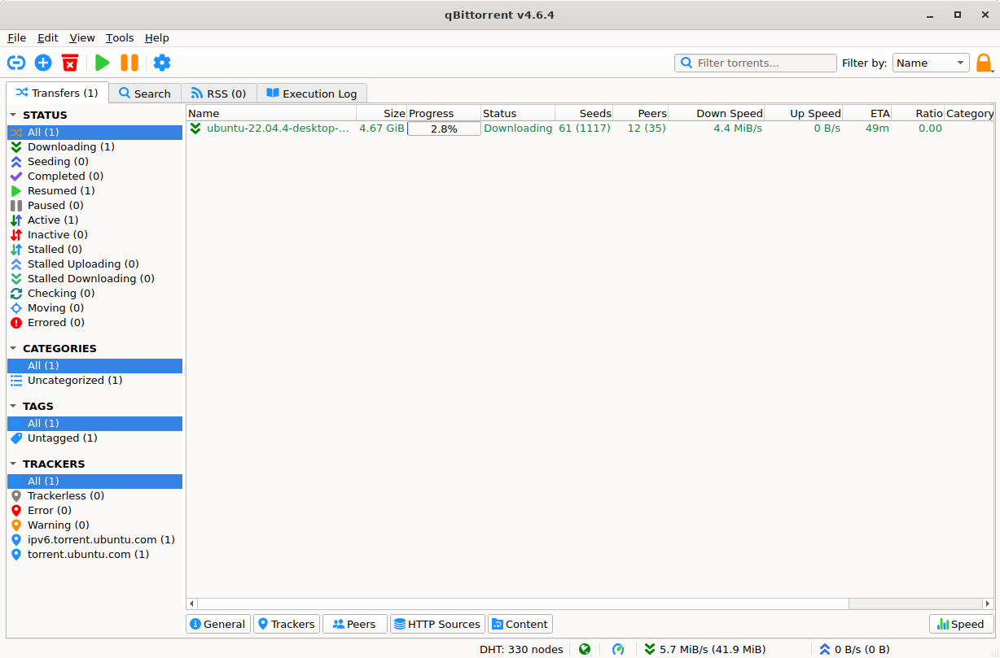

**Скачать приложение:**
  - [Официальный сайт](https://www.qbittorrent.org/)

Бесплатный торрент-клиент с открытым исходным кодом, не содержащий рекламы и скрытых трекеров. qBittorrent поддерживает последовательную загрузку, шифрование, ограничение скорости, встроенный поиск по торрент-трекерам, RSS-ленты и удалённое управление через веб-интерфейс. Работает на Windows, macOS, Linux и FreeBSD.

## Jopdf (PDF редактор):
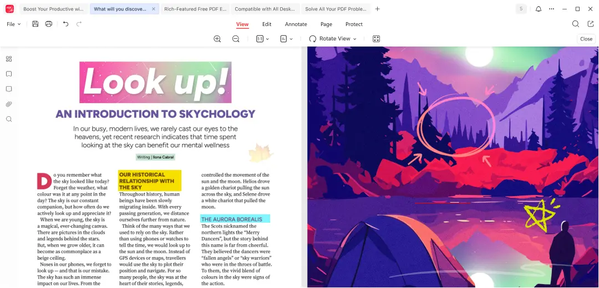

**Скачать приложение:**
  - [Официальный сайт](https://jopdf.com/)

Программа для создания, конвертации и редактирования PDF-файлов. Поддерживает объединение, разделение, сжатие и защиту документов паролем. Jopdf также позволяет конвертировать изображения и офисные документы в формат PDF. Доступна для Windows.

## 7-Zip (Архиватор):
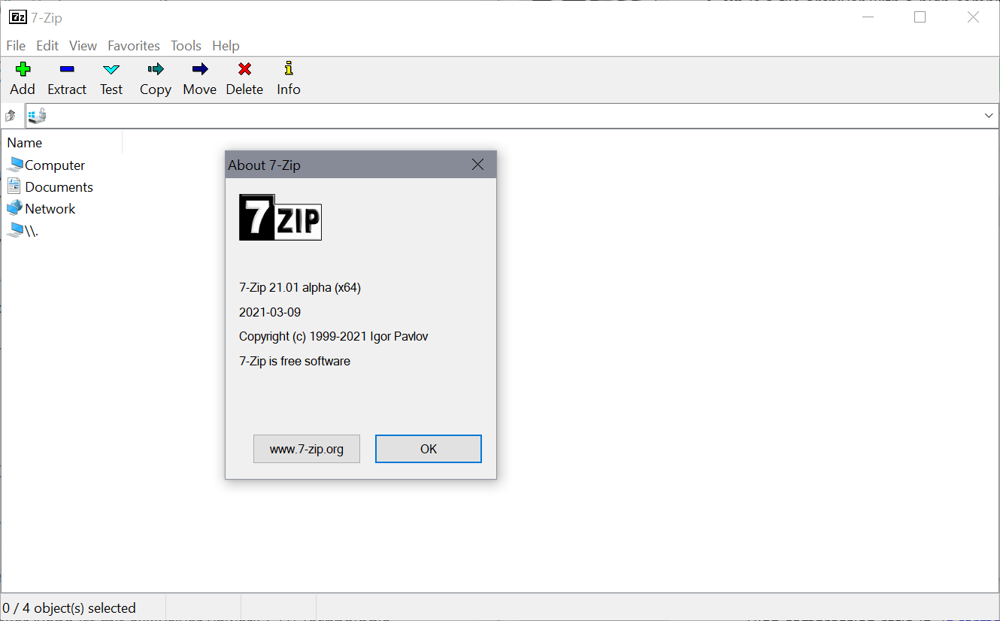

**Скачать приложение:**
  - [Официальный сайт](https://www.7-zip.org/)

Мощный архиватор с открытым исходным кодом и высокой степенью сжатия в формате 7z (алгоритм LZMA2). 7-Zip поддерживает множество форматов (ZIP, RAR, TAR, GZIP, WIM и другие) и обладает собственным менеджером файлов с двухпанельным интерфейсом. Доступен для Windows, а также существует версия p7zip для Linux.

## WinDynamicDesktop (Динамические обои):
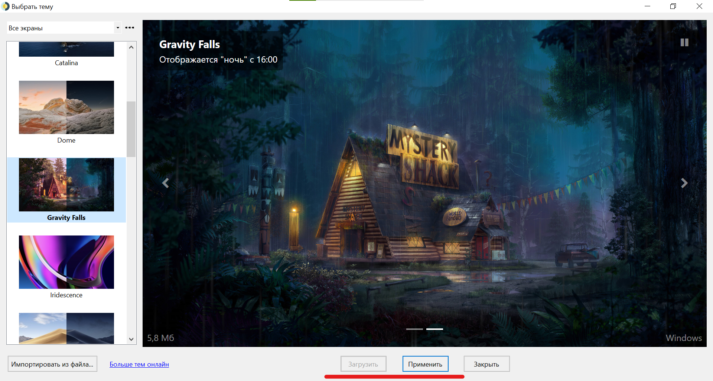

**Скачать приложение:**
  - [Официальный сайт](https://windd.info/)
  - [Microsoft Store](https://apps.microsoft.com/detail/9nm8n7dq3z5f?hl=ru-RU&gl=RU)
  - [GitHub](https://github.com/t1m0thyj/WinDynamicDesktop)

**Настройка:**
  - ["Как настроить динамические обои на Windows"](https://github.com/Un1korm/Custom-day-night-double-wallpaper-WinDynamicDesktop) (Un1korm)

Программа, которая добавляет на Windows динамические обои, меняющиеся в зависимости от времени суток или географического положения (аналог функции macOS). WinDynamicDesktop поддерживает загрузку готовых наборов обоев, создание собственных расписаний и автоматическое обновление фона рабочего стола. Доступна для Windows 10 и 11.

## AllDup (Поиск дубликатов):
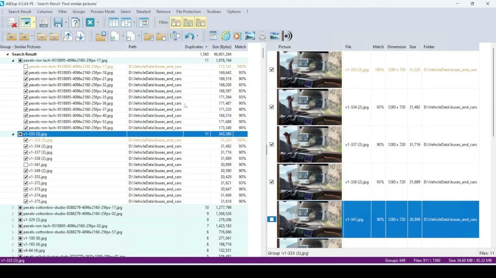

**Скачать приложение:**
  - [Официальный сайт](https://alldup.info/en/alldup/download.php)

Мощный бесплатный инструмент для поиска и удаления дубликатов файлов (изображения, музыка, видео, документы). AllDup сравнивает файлы по имени, размеру, содержимому, дате изменения, хешу (MD5, SHA-1) и другим параметрам. Поддерживает поиск на внутренних и внешних дисках, в сетевых папках и на NAS. Доступен только для Windows.

## WinToys (Оптимизация Windows):
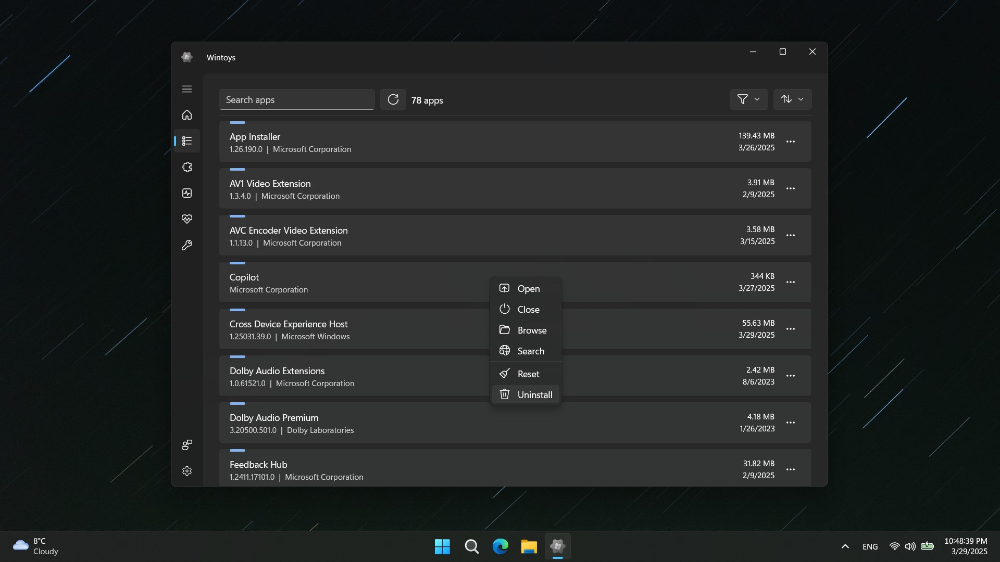

**Скачать приложение:**
  - [Официальный сайт](https://bogdan-patraucean.github.io/about/wintoys/)
  - [Microsoft Store](https://apps.microsoft.com/detail/9p8ltpgcbzxd?hl=ru-RU&gl=RU)

**Настройка:**
  - ["Оптимизируй Windows и сделай её быстрее..."](https://www.youtube.com/watch?v=x4er0gbQYHA) (Werstey)

Бесплатная утилита с открытым исходным кодом для тонкой настройки Windows 11 и 10. WinToys объединяет множество скрытых настроек системы в удобном интерфейсе: отключение телеметрии, настройка контекстного меню, управление автозагрузкой, кастомизация интерфейса и оптимизация производительности. Доступна в Microsoft Store.

## Win10Tweaker (Оптимизация Windows):
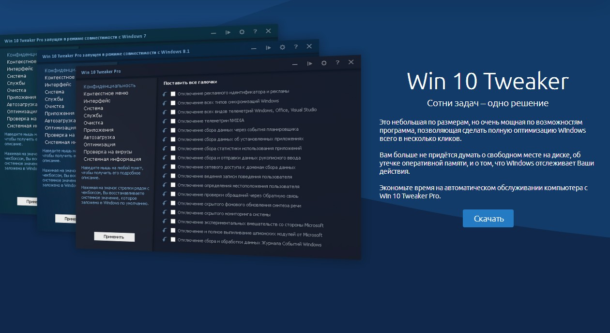

**Скачать приложение:**
  - [Официальный сайт](https://win10tweaker.ru/)

**Настройка:**
  - ["Оптимизация Windows. Пошаговый гайд"](https://youtu.be/UemdsjxTdfg) (MartyFiles)

Портативная утилита для тонкой настройки Windows 10 и 11, позволяющая отключить телеметрию, рекламу, ненужные службы, настроить контекстное меню, проводник и другие скрытые параметры системы. Win10Tweaker не требует установки и включает функцию создания точки восстановления перед изменениями. Доступен для Windows.

## iCloud (Облачное хранилище):
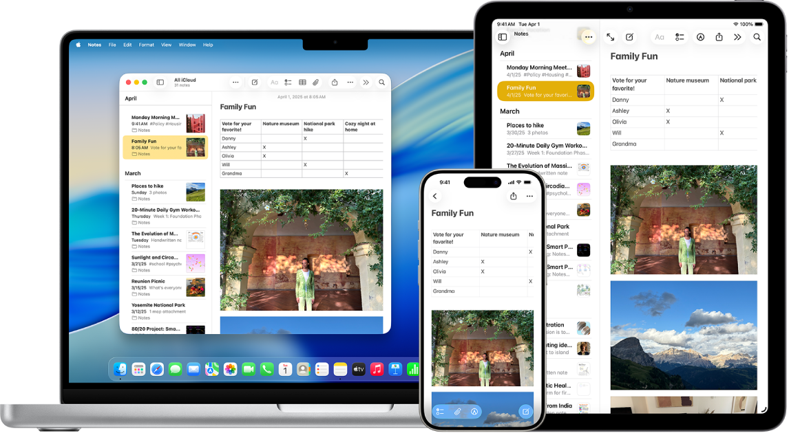

**Скачать приложение:**
  - [Microsoft Store](https://apps.microsoft.com/detail/9pktq5699m62?hl=ru-RU&gl=RU)

Облачный сервис от Apple для хранения фотографий, видео, документов, заметок, контактов и резервных копий устройств. Приложение iCloud для Windows позволяет синхронизировать данные между iPhone/iPad/Mac и компьютером с Windows, включая общий доступ к фото, паролям, закладкам и файлам через проводник. Доступен на Windows, macOS, iOS, Android (веб-версия).

## MinerSearch (Поиск и удаление майнеров):
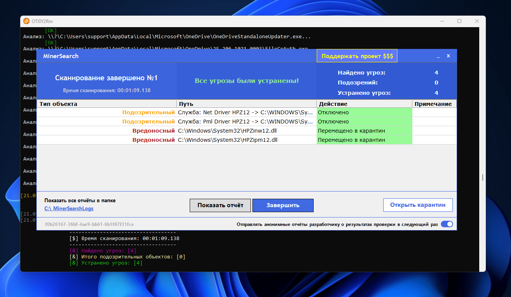

**Скачать приложение:**
  - [GitHub](https://github.com/BlendLog/MinerSearch)

Специализированная утилита для поиска и полного удаления скрытых криптомайнеров в системе Windows. MinerSearch не заменяет антивирус, а является узконаправленным инструментом для борьбы с вредоносным ПО, которое незаметно использует ресурсы процессора или видеокарты для добычи криптовалюты. Программа завершает вредоносные процессы, удаляет файлы, очищает автозапуск и планировщик задач, а также обнаруживает rootkit R77. Обнаруженные угрозы помещаются в карантин с возможностью восстановления. Требует прав администратора и наличия .NET Framework 4.7.2. Доступна только для Windows.
