# Useful-apps-for-Windows
В данном репозитории мы подробно рассмотрим ряд полезных приложений для Windows, способных значительно упростить вашу работу и повысить продуктивность. Мы уделим внимание не только функциональным программам, но и утилитам для оптимизации системы, которые помогут поддерживать ваш компьютер в отличном состоянии. Эти инструменты позволят вам максимально эффективно использовать возможности операционной системы Windows и сделают вашу работу более комфортной и безопасной.

## Подборка видео (на YouTube):
- ["Удали эти программы прямо сейчас! Windows 10/11 улучшение"](https://www.youtube.com/watch?v=6KE4lt2KCa8) (FISPEKT)
- ["Скачай эти программы прямо сейчас! Windows 10/11 учлучшение"](https://www.youtube.com/watch?v=yaUhNYsRyi0) (FISPEKT)
- ["Делаем Windows 10/11 красивее и удобнее"](https://www.youtube.com/watch?v=kYYqyjjNtfc) (FISPEKT)
- ["Настраиваем qBitTorrent"](https://www.youtube.com/watch?v=34XfuxGRG4w) (IT Explainer)
- ["19 бесплатных программ для Windows..."](https://www.youtube.com/watch?v=IgL9GVwIasc) (Werstey)
- ["Красивые программы для Windows 11..."](https://www.youtube.com/watch?v=u-EW9tLMfZg) (MartyFiles)

## Краткая таблица приложений:
| Коммуникация       | Оптимизация ПК                | Работа и игры                 |
|-------------------------------|-------------------------------|-------------------------------|
| [Mozilla Firefox (Браузер)](#mozilla-firefox-браузер) | [Revo Uninstaller (Деинсталлятор)](#revo-uninstaller-деинсталлятор-программ) | [Steam (Магазин игр)](#steam-магазин-игр) |
| [Google Chrome (Браузер)](#google-chrome-браузер) | [Iobit Driver Booster (Обнова драйверов)](#iobit-driver-booster-обновление-драйверов) | [Epic Games (Магазин игр)](#epic-games-магазин-игр) |
| [Telegram (Мессенджер)](#telegram-мессенджер) | [Everything (Поиск файлов)](#everything-поисковик-файлов) | [Obsidian (Заметки)](#obsidian-программа-для-заметок) |
| [Discord (Геймерская платформа)](#discord-геймерская-платформа) | [Windscribe (VPN-сервис)](#winscribe-vpn-сервис) |  |
|  | [Bitwarden (Менеджер паролей)](#bitwarden-менеджер-паролей) |  |

## Mozilla FireFox (Браузер):
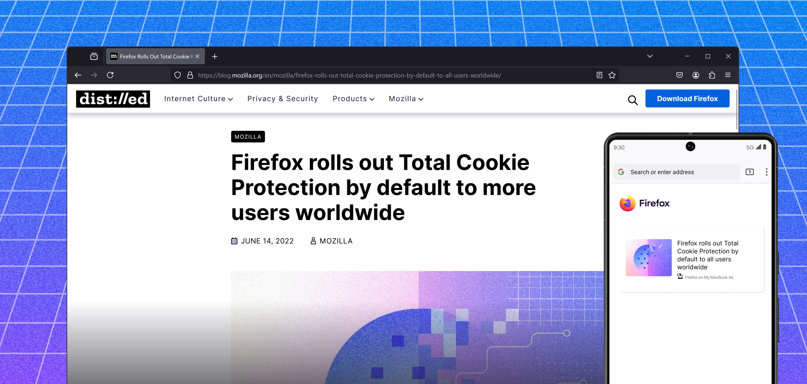

Скачать приложение:
  - [Официальный сайт Mozilla](https://www.mozilla.org/ru/firefox/new/)
  - [Microsoft Store](https://apps.microsoft.com/detail/9NZVDKPMR9RD?hl=ru&gl=RU&ocid=pdpshare)
  - [Apple Store](https://apps.apple.com/us/app/firefox-private-web-browser/id989804926)

Настройка:
  - ["Full-FireFox-browser-setup"](https://github.com/Un1korm/Full-FireFox-browser-setup) (Un1korm)
  - ["Настраиваем Firefox для полной анонимности..."](https://www.youtube.com/watch?v=XLOvZCdzwp8) (CyberYozh)
  - ["Кастомизация Firefox - сторонние темы..."](https://www.youtube.com/watch?v=pcQzxkQwFk0&t) (Markella's)
  - ["Прокачка браузера FireFox..."](https://www.youtube.com/watch?v=PGF8H-iCudk&t) (ГЛАВНАЯ МРАЗЬ ЮТУБА)

Это бесплатный веб-браузер с открытым исходным кодом, разработанный компанией Mozilla. Он предлагает пользователям высокую скорость загрузки страниц, поддержку множества расширений и функций для повышения безопасности и конфиденциальности. Firefox включает встроенные инструменты для блокировки трекеров и защиты от вредоносных сайтов. Браузер доступен на различных платформах, включая Windows, macOS, Linux, Android и iOS.

## Google Chrome (Браузер):
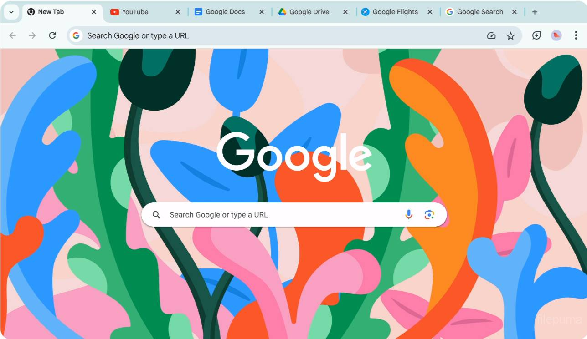

Скачать приложение:
  - [Официальный сайт Google](https://www.google.com/chrome/) (Обычная версия)
  - [Официальный сайт Google](https://www.google.com/chrome/what-you-make-of-it/) (Web версия)
  - [Apple Store](https://apps.apple.com/ru/app/chrome-%D0%B1%D1%80%D0%B0%D1%83%D0%B7%D0%B5%D1%80-%D0%BE%D1%82-google/id535886823)

Настройка:
  - ["Кастомизация интерфейса Chrome..."](https://www.youtube.com/watch?v=nYhK3FhaHHk) (OfficialBRO)
  - ["Give your Google Chrome a Clean and Professional Look"](https://www.youtube.com/watch?v=0sbS69jSz24) (PosInTech)
  - ["34 ЛУЧШИХ РАСШИРЕНИЙ ДЛЯ Chrome..."](https://www.youtube.com/watch?v=DMp5GiK6zWk) (Andegrand)
  
Бесплатный веб-браузер, разработанный компанией Google, известен своей высокой скоростью и простотой использования. Он поддерживает множество расширений и тем, что позволяет пользователям настраивать браузер под свои нужды. Chrome также предлагает функции синхронизации между устройствами, встроенную защиту от вредоносных сайтов и регулярные обновления для повышения безопасности. Браузер доступен на различных платформах, включая Windows, macOS, Linux, Android и iOS.

## Bitwarden (Менеджер паролей):
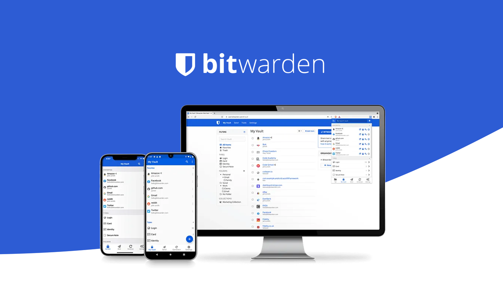

Скачать приложение:
  - [Официальный сайт Bitwarden](https://bitwarden.com/download/)
  - [Официальный сайт Mozilla](https://addons.mozilla.org/en-US/firefox/addon/bitwarden-password-manager/?browser=firefox) (Расширение в FireFox)
  - [Официальный сайт Google](https://chromewebstore.google.com/detail/bitwarden-%D0%BC%D0%B5%D0%BD%D0%B5%D0%B4%D0%B6%D0%B5%D1%80-%D0%BF%D0%B0%D1%80%D0%BE%D0%BB%D0%B5/nngceckbapebfimnlniiiahkandclblb?hl=ru&utm_source=ext_sidebar) (Расширение в Google)
  - [Microsoft Store](https://apps.microsoft.com/detail/9PJSDV0VPK04?hl=ru&gl=RU&ocid=pdpshare)
  - [Apple Store](https://apps.apple.com/us/app/bitwarden-password-manager/id1137397744)

Менеджер паролей Bitwarden предлагает пользователям безопасное хранение и управление паролями, а также генерацию надежных паролей для различных учетных записей. Он обеспечивает шифрование данных на стороне клиента, что гарантирует защиту личной информации. Bitwarden поддерживает синхронизацию между устройствами и предоставляет возможность совместного использования паролей с другими пользователями. Приложение доступно на различных платформах, включая Windows, macOS, Linux, Android и iOS.

## Winscribe (VPN-сервис):

Скачать приложение:
  - [Официальный сайт Winscribe](https://windscribe.com/download/)
  - [Apple Store](https://apps.apple.com/us/app/windscribe-vpn/id1129435228)

Настройка:
  - ["КАК ПОЛЬЗОВАТЬСЯ WINDSCRIBE..."](https://www.youtube.com/watch?v=lkp6Tx0AcwY) (VPN Эксперт)

Это VPN-сервис, который обеспечивает безопасное и анонимное интернет-соединение, позволяя пользователям обходить географические ограничения и защищать свои данные от слежки. Он предлагает функции шифрования, блокировки рекламы и защиты от утечек DNS. WinScribe также предоставляет возможность выбора серверов в различных странах для оптимизации скорости и доступа к контенту. Приложение доступно на различных платформах, включая Windows, macOS, Linux, Android и iOS.

## Telegram (Мессенджер):
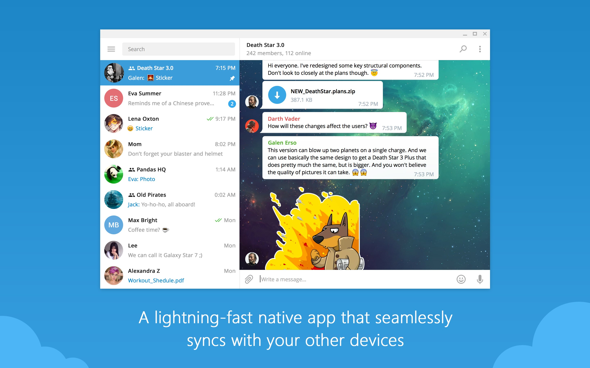

Скачать приложение:
  - [Официальный сайт Telegram](https://desktop.telegram.org/)
  - [Microsoft Store](https://apps.microsoft.com/detail/9NZTWSQNTD0S?hl=neutral&gl=RU&ocid=pdpshare)
  - [Apple Store](https://apps.apple.com/us/app/telegram-messenger/id686449807)

Настройка:
  - ["Анонимность в Телеграм..."](https://www.youtube.com/watch?v=cFWK7EozcIQ) (Фантомас)

Популярный мессенджер позволяет пользователям обмениваться текстовыми сообщениями, фотографиями, видео и файлами. Он предлагает функции групповых чатов, каналов и ботов, что делает его удобным для общения и получения информации. Telegram акцентирует внимание на безопасности, предлагая шифрование сообщений и возможность создания секретных чатов. Приложение доступно на различных платформах, включая Windows, macOS, Linux, Android и iOS.

## Discord (Геймерская платформа):
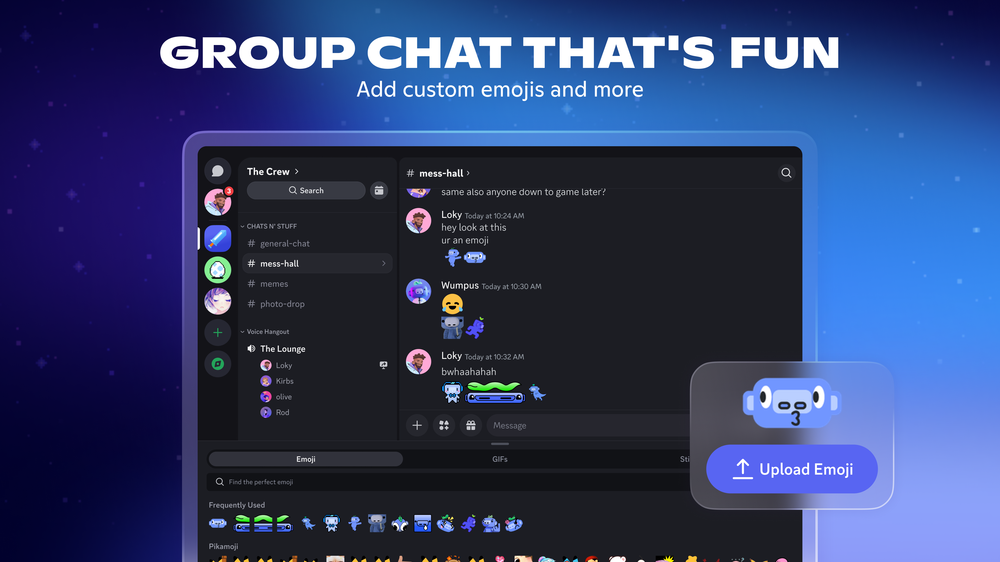

Скачать приложение:
  - [Официальный сайт Discord](https://discord.com/)
  - [Microsoft Store](https://apps.microsoft.com/detail/XPDC2RH70K22MN?hl=ru&gl=RU&ocid=pdpshare)
  - [Apple Store](https://apps.apple.com/us/app/discord-talk-play-hang-out/id985746746)

Настройка:
  - ["Лучшие и полезные ПЛАГИНЫ для ДИСКОРД..."](https://www.youtube.com/watch?v=Sm_JkNS2cJw) (Фрости)
  - ["Лучшие и полезные ПЛАГИНЫ ДИСКОРД..."](https://www.youtube.com/watch?v=KO5c199fbpM) (OfficialBRO)

Многофункциональная платформа для общения, ориентированная на геймеров и сообщества, позволяет пользователям создавать текстовые и голосовые каналы. Discord предлагает функции видеозвонков, обмена файлами и интеграцию с играми, что делает его удобным для совместной игры и общения. Пользователи могут настраивать свои серверы, добавлять ботов и управлять правами доступа. Приложение доступно на различных платформах, включая Windows, macOS, Linux, Android и iOS.

## Steam (Магазин игр):
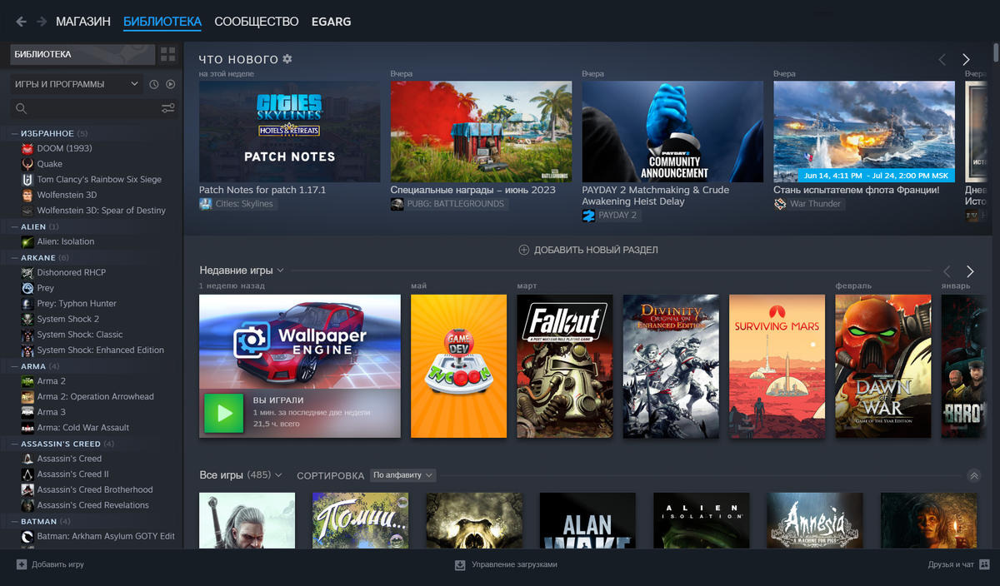

Скачать приложение:
  - [Официальный сайт Steam](https://store.steampowered.com/about/)
  - [Apple Store](https://apps.apple.com/us/app/steam-mobile/id495369748)

Настройка:
  - ["ПРОВЕРИЛ 32 СЕРВИСА ПОПОЛНЕНИЯ СТИМ..."](https://www.youtube.com/watch?v=q4NBiRZatQo&t) (STEAMATE)
  - ["Смена региона STEAM 2025..."](https://www.youtube.com/watch?v=uKawuDbiBDQ) (Buzzard)
  - ["Как Пополнить Стим 2025..."](https://www.youtube.com/watch?v=ZRuYllFCDoA) (DorrianKarnett™)

Платформа для цифровой дистрибуции игр и программного обеспечения, позволяющая пользователям покупать, загружать и играть в игры. Steam предлагает функции социальной сети, включая возможность добавления друзей, чатов и групповых игр. Пользователи также могут участвовать в распродажах и получать доступ к эксклюзивным предложениям. Приложение доступно на различных платформах, включая Windows, macOS и Linux.

## Epic Games (Магазин игр):
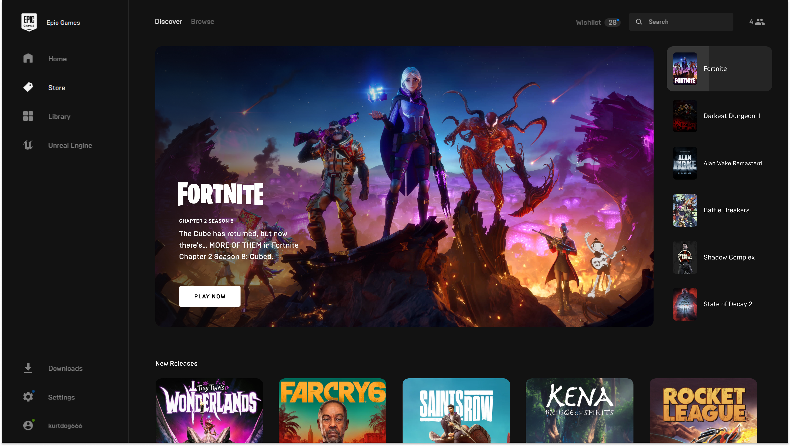

Скачать приложение:
  - [Официальный сайт Epic Games](https://store.epicgames.com/ru/download)
  - [Microsoft Store](https://apps.microsoft.com/detail/XP99VR1BPSBQJ2?hl=ru&gl=RU&ocid=pdpshare)

Настройка:
  - ["СМЕНА РЕГИОНА в EPIC GAMES STORE..."](https://www.youtube.com/watch?v=1poDn4xBIYI) (heybk)
  - ["Как оплатить игру в EPIC GAMES рублями?..."](https://www.youtube.com/watch?v=hMx6S3lUcZE) (Pay Unlimited)

Платформа для цифровой дистрибуции игр, предлагающая пользователям доступ к большому количеству игр, включая эксклюзивные проекты. Epic Games Store регулярно проводит распродажи и предлагает бесплатные игры, что привлекает множество пользователей. Платформа также поддерживает функции социальной сети, такие как добавление друзей и создание групп. Приложение доступно на различных платформах, включая Windows, macOS и мобильные устройства.

## Obsidian (Программа для заметок):

Скачать приложение:
  - [Официальный сайт Obsidian](https://obsidian.md/download)
  - [Apple Store](https://apps.apple.com/us/app/obsidian-connected-notes/id1557175442)

Настройка:
  - ["Как запоминать ВСЕ с помощью Obsidian..."](https://www.youtube.com/watch?v=Tae0BwhenRQ&t) (ZProger [IT])
  - ["Вам всем нужны эти плагины Obsidian!"](https://www.youtube.com/watch?v=QUK0euS_o1Y) (ZProger [IT])

Программа для создания и управления заметками, основанная на принципах связного мышления и организации информации. Obsidian позволяет пользователям создавать заметки в формате Markdown и связывать их между собой, что облегчает навигацию и поиск информации. Она поддерживает плагины и темы, что позволяет настраивать интерфейс под свои нужды. Приложение доступно на различных платформах, включая Windows, macOS и Linux.

## Everything (Поисковик файлов):
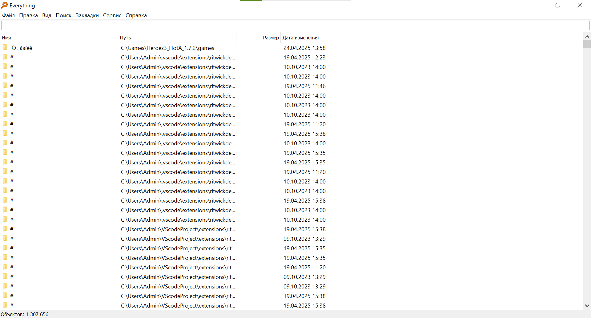

Скачать приложение:
  - [Официальный сайт Everything](https://www.voidtools.com/ru-ru/downloads/)

Программа для быстрого поиска файлов и папок на компьютере, обеспечивающая мгновенные результаты благодаря индексации содержимого дисков. Everything позволяет пользователям легко находить нужные файлы по имени и предоставляет возможность фильтрации и сортировки результатов. Интерфейс программы прост и интуитивно понятен, что делает её удобной в использовании. Приложение доступно на платформах Windows и macOS.

## Revo Uninstaller (Деинсталлятор программ):
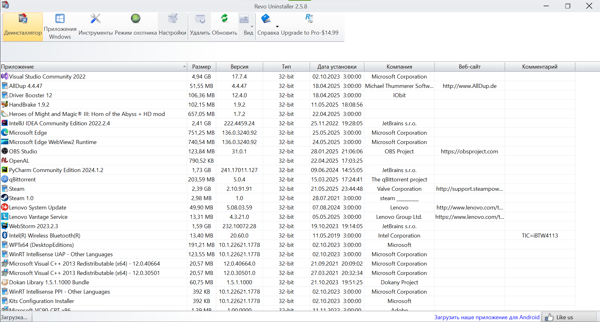

Скачать приложение:
  - [Официальный сайт Revo Uninstaller](https://www.revouninstaller.com/ru/revo-uninstaller-free-download/)

Программа для удаления приложений и очистки системы от остатков файлов и записей в реестре. Revo Uninstaller предлагает несколько режимов удаления, включая стандартный и продвинутый, что позволяет пользователям эффективно управлять установленными программами. Она также включает инструменты для управления автозагрузкой и поиска программ. Приложение доступно на платформах Windows.

## Iobit Driver Booster (Обновление драйверов):
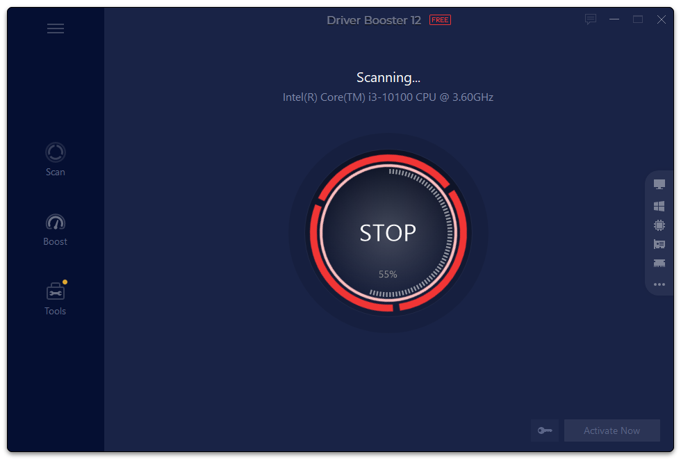

Скачать приложение:
  - [Официальный сайт IObit Driver Booster](https://ru.iobit.com/driver-booster.php)
  - [Microsoft Store](https://apps.microsoft.com/detail/XPFM0B62TJ71KR?hl=ru&gl=RU&ocid=pdpshare)

Программа для автоматического обновления драйверов на компьютере, обеспечивающая стабильную работу оборудования и улучшение производительности системы. IObit Driver Booster сканирует систему на наличие устаревших драйверов и предлагает их обновление одним кликом. Она также включает функции резервного копирования и восстановления драйверов. Приложение доступно на платформах Windows.

## ShareX (Скриншоты и запись экрана):
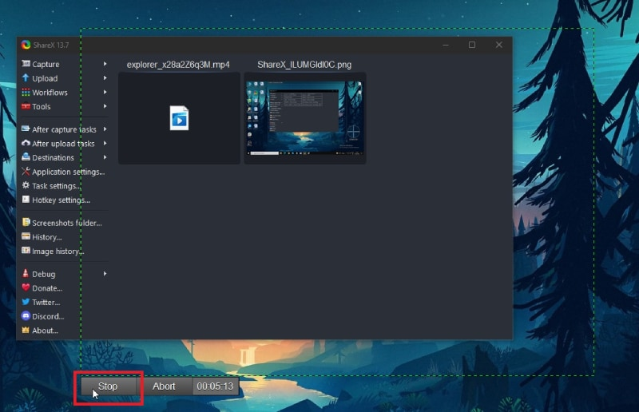

**Скачать приложение:**
  - [Официальный сайт ShareX](https://getsharex.com/)
  - [Microsoft Store](https://apps.microsoft.com/detail/9nblggh4z1sp?hl=ru-RU&gl=RU)
  - [GitHub Releases](https://github.com/ShareX/ShareX/releases)
  - [Steam](https://store.steampowered.com/app/400040/ShareX/)

Мощная программа с открытым исходным кодом для создания скриншотов, записи экрана и загрузки файлов. ShareX поддерживает множество сервисов для быстрой публикации изображений, текста и видео. Пользователи могут автоматизировать рабочие процессы, настраивать горячие клавиши и использовать редактор изображений. Доступна только для Windows.

## VLC Media Player (Медиапроигрыватель):

**Скачать приложение:**
  - [Официальный сайт VLC](https://www.videolan.org/vlc/)
  - [Microsoft Store](https://apps.microsoft.com/detail/xpdm1zw6815mqm?hl=ru-RU&gl=AR)
  - [Apple Store](https://apps.apple.com/app/vlc-media-player/id650377962)

Универсальный бесплатный медиапроигрыватель с открытым исходным кодом, поддерживающий практически все форматы аудио и видео без необходимости установки дополнительных кодеков. VLC умеет воспроизводить повреждённые или недогруженные файлы, стримить контент по сети, применять фильтры и менять скины. Доступен на Windows, macOS, Linux, Android и iOS.

## OBS Studio (Запись и стриминг):
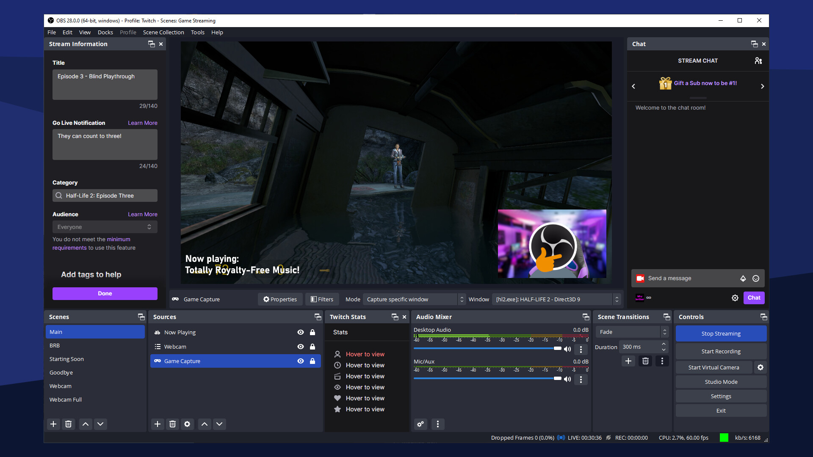

**Скачать приложение:**
  - [Официальный сайт OBS Studio](https://obsproject.com/ru)
  - [Microsoft Store](https://apps.microsoft.com/detail/xpffh613w8v6lv?hl=ru-RU&gl=RU)

Профессиональное программное обеспечение с открытым исходным кодом для захвата видео, записи экрана и потокового вещания в реальном времени. OBS Studio позволяет создавать сцены с множеством источников (окна, игры, веб-камеры), настраивать переходы, применять фильтры и использовать горячие клавиши. Поддерживает все популярные платформы для стриминга. Доступен на Windows, macOS и Linux.

## BleachBit (Очистка системы):
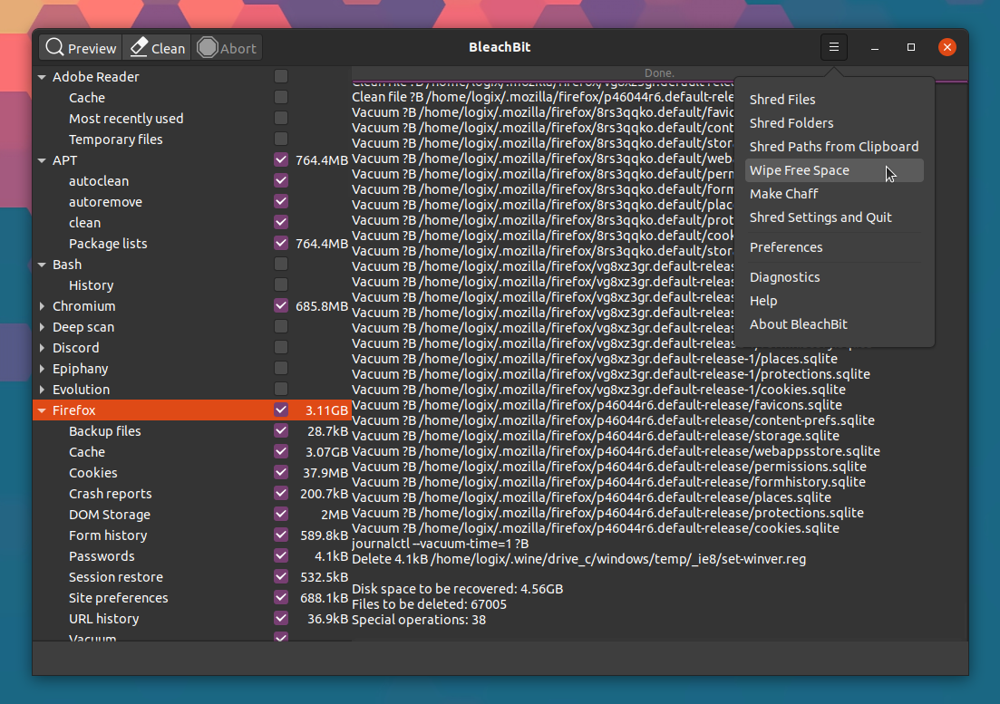

**Скачать приложение:**
  - [Официальный сайт BleachBit](https://www.bleachbit.org/)

Бесплатная программа с открытым исходным кодом для очистки дискового пространства и защиты конфиденциальности. BleachBit удаляет временные файлы, кэш браузеров, cookies, логи и другие ненужные данные. Также включает функцию затирания свободного места для безвозвратного удаления файлов. Поддерживает Windows и Linux.

## LocalSend (Обмен файлами по сети):
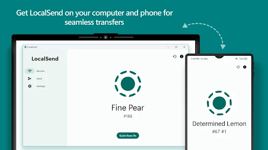

**Скачать приложение:**
  - [Официальный сайт LocalSend](https://localsend.org/)
  - [Microsoft Store](https://apps.microsoft.com/detail/9NBLGGH4Z1TQ)
  - [Apple Store](https://apps.apple.com/app/localsend/id1661733229)
  - [Google Play](https://play.google.com/store/apps/details?id=org.localsend.localsend)

Бесплатное приложение с открытым исходным кодом для мгновенной передачи файлов между устройствами в локальной сети. LocalSend не требует интернета, регистрации или облачных сервисов — всё работает по технологии peer-to-peer. Поддерживает отправку фото, видео, документов и целых папок. Доступен на Windows, macOS, Linux, Android и iOS.
